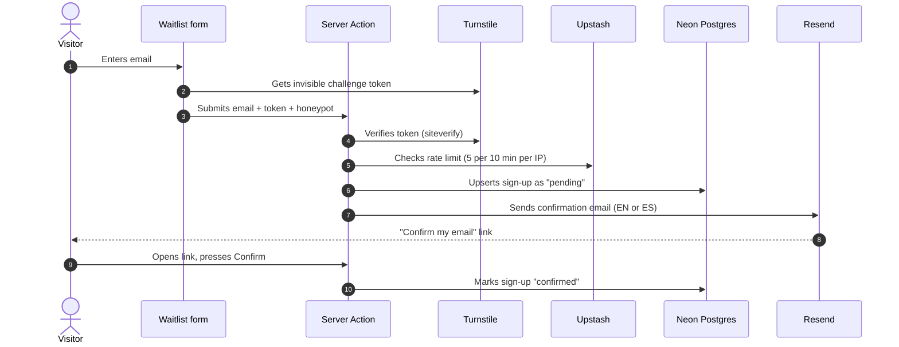

<div align="center">


### Small-group reporting for churches: the bilingual pre-launch site and waitlist

[**ekklesiaio.com**](https://ekklesiaio.com) · [English](https://ekklesiaio.com/en) · [Español](https://ekklesiaio.com/es)


</div>

---

## About

**ekklesiaio** is a SaaS that helps churches collect and understand reports from their small groups. This repository is its pre-launch landing page. The page does one thing: it explains the product and collects waitlist sign-ups in **English and Spanish**.

It's a small site, but it's built like a production app. That means a double opt-in email flow, bot protection, rate limiting, data retention, accessibility, SEO and performance budgets, all covered by unit tests.

## Highlights

- **Bilingual from the ground up.** Locale-prefixed routes (`/en`, `/es`) with `next-intl`, hreflang alternates, translated share images and emails. A CI-style check (`npm run check:messages`) fails if the two locale files ever drift apart.
- **Double opt-in waitlist.** Server Actions validate with a shared `zod/mini` schema. Confirm and unsubscribe links only show a button, so email security scanners that pre-fetch links can't confirm or unsubscribe anyone. One-click unsubscribe follows RFC 8058 (`List-Unsubscribe-Post`).
- **Abuse protection.** Cloudflare Turnstile (invisible, verified server-side with a hostname check in production), a honeypot field, and an Upstash Redis rate limit (5 requests per IP per 10 minutes). Each layer fails closed in production when it's misconfigured.
- **Race-safe data layer.** Resend throttling and state changes are conditional `UPDATE`s, so two concurrent submits can't both send an email. Only the SHA-256 hash of the confirm token is stored.
- **Privacy by design.** No cookies, so no consent banner. A daily Vercel Cron deletes unconfirmed sign-ups after 30 days. The published privacy policy is rendered word for word from approved copy.
- **Performance and accessibility.** Lighthouse scores 100 for accessibility and SEO and 99–100 for desktop performance. Turnstile loads only when someone first interacts with the form (that alone was worth ~15 mobile Lighthouse points). Fonts are self-hosted subsets, and `/en` and `/es` are fully prerendered.
- **Dynamic share images.** Per-locale Open Graph cards generated at the edge with `next/og` (Satori).
- **Design system.** Tailwind v4 `@theme` tokens in [`brand/theme.css`](brand/theme.css), with no UI kit and no icon library. Every color, radius and type style comes from a token.

## Tech stack

| Concern | Choice |
| --- | --- |
| Framework | [Next.js 16](https://nextjs.org) (App Router, Server Components, Server Actions, `cacheComponents`) |
| Language | TypeScript (strict) |
| Styling | [Tailwind CSS v4](https://tailwindcss.com) with design tokens |
| i18n | [next-intl](https://next-intl.dev) |
| Database | [Neon](https://neon.tech) Postgres + [Drizzle ORM](https://orm.drizzle.team) |
| Email | [Resend](https://resend.com) + [React Email](https://react.email) |
| Bot protection | [Cloudflare Turnstile](https://www.cloudflare.com/products/turnstile/) |
| Rate limiting | [Upstash Redis](https://upstash.com) + `@upstash/ratelimit` |
| Validation | [zod](https://zod.dev) (`zod/mini`) |
| Analytics | [Vercel Web Analytics](https://vercel.com/analytics) (cookieless) |
| Testing | [Vitest](https://vitest.dev) |
| Hosting | [Vercel](https://vercel.com), DNS on Cloudflare |

## How the waitlist works



Unconfirmed sign-ups older than 30 days are removed by a daily cron job (`/api/cron/purge-pending`).

## Project structure

```
src/
├── app/
│   ├── [locale]/               # /en and /es: landing, privacy, confirm, unsubscribe
│   │   └── opengraph-image.tsx # per-locale share card
│   ├── api/
│   │   ├── cron/purge-pending/ # 30-day retention job
│   │   └── unsubscribe/        # RFC 8058 one-click unsubscribe
│   ├── sitemap.ts · robots.ts
├── components/
│   ├── sections/               # hero, problem, how-it-works, features, …
│   └── waitlist-form*.tsx      # server wrapper + client form
├── i18n/                       # next-intl routing and request config
├── lib/                        # shared schema, site URL, social links
├── server/                     # actions, signup rules, repo (all SQL), email, Turnstile, rate limit
│   ├── db/                     # Drizzle schema and client
│   └── email/                  # React Email template + sender
└── proxy.ts                    # locale negotiation (Next 16's middleware)
messages/                       # en.json / es.json: all user-facing copy
brand/theme.css                 # Tailwind v4 design tokens
drizzle/                        # SQL migrations
docs/                           # build spec, approved design references, privacy policy
```

## Getting started

### Prerequisites

- **Node.js 24** (see `engines` in `package.json`)
- **npm**
- A **Postgres** database. A free [Neon](https://neon.tech) branch works well.
- *Optional:* a [Resend](https://resend.com) API key. Without one, the confirmation link is printed to the dev server console instead of emailed.

You don't need Cloudflare or Upstash accounts for local development: Turnstile has public test keys, and the rate limit is skipped when Upstash isn't configured.

### 1. Clone and install

```bash
git clone https://github.com/Luis-Palacios/ekklesiaio-landing.git
cd ekklesiaio-landing
npm install
```

### 2. Configure environment variables

```bash
cp .env.example .env.local
```

The minimum for local development:

```bash
NEXT_PUBLIC_SITE_URL=http://localhost:3000
DATABASE_URL=postgres://…            # your Neon (or local) connection string

# Cloudflare's public always-pass test keys
NEXT_PUBLIC_TURNSTILE_SITE_KEY=1x00000000000000000000BB
TURNSTILE_SECRET_KEY=1x0000000000000000000000000000000AA
```

<details>
<summary><b>All environment variables</b></summary>

| Variable | Required | Purpose |
| --- | --- | --- |
| `NEXT_PUBLIC_SITE_URL` | Yes | Canonical origin for metadata, sitemap and email links |
| `DATABASE_URL` | Yes | Neon pooled connection string |
| `DATABASE_URL_UNPOOLED` | Vercel only | Direct connection used for build-time migrations |
| `NEXT_PUBLIC_TURNSTILE_SITE_KEY` | Yes | Turnstile site key |
| `TURNSTILE_SECRET_KEY` | Yes | Turnstile secret. Sign-ups fail without it. |
| `RESEND_API_KEY` | Production | Sends confirmation emails |
| `EMAIL_FROM` | Production | Sender address (bare address only) |
| `EMAIL_FROM_NAME` | No | Sender display name |
| `CONTACT_EMAIL` | No | Footer contact link (read at build time) |
| `KV_REST_API_URL` / `KV_REST_API_TOKEN` | Production | Upstash Redis for rate limiting |
| `CRON_SECRET` | Production | Authorizes the daily retention cron |

</details>

### 3. Create the database table

```bash
npm run db:migrate
```

### 4. Run it

```bash
npm run dev
```

Open [http://localhost:3000](http://localhost:3000). You'll be redirected to `/en` or `/es` based on your browser's language.

## Scripts

| Command | Description |
| --- | --- |
| `npm run dev` | Start the dev server (Turbopack) |
| `npm run build` / `npm start` | Production build and serve |
| `npm test` | Run the Vitest unit tests |
| `npm run lint` | ESLint (Next core-web-vitals + TypeScript + Prettier) |
| `npm run typecheck` | Generate route types and run `tsc --noEmit` |
| `npm run check:messages` | Make sure `en.json` and `es.json` have identical keys |
| `npm run format` | Format with Prettier (with Tailwind class sorting) |
| `npm run db:generate` | Generate a migration from the Drizzle schema |
| `npm run db:migrate` | Apply migrations to the database in `DATABASE_URL` |

## Testing

```bash
npm test
```

The unit tests cover the business logic: signup rules, the waitlist and confirm Server Actions, subscription state changes, Turnstile verification, email rendering and sending, the retention job and its cron authorization, and the shared validation schema. Database access is isolated in `src/server/waitlist-repo.ts`, so tests mock the repository instead of a database.

Before opening a pull request, run:

```bash
npm run lint && npm run typecheck && npm run check:messages && npm test
```

## Deployment

The site is deployed on **Vercel**, and every pull request gets a Preview deployment.

1. **Import the repo** into Vercel. The framework preset is detected automatically.
2. **Add integrations** from the Vercel Marketplace:
   - **Neon**, which sets `DATABASE_URL` and `DATABASE_URL_UNPOOLED`
   - **Upstash Redis**, which sets `KV_REST_API_URL` and `KV_REST_API_TOKEN`
3. **Set the remaining environment variables** (see the table above). Use real Turnstile keys in Production and the test keys in Preview.
4. **Enable Web Analytics** in the project settings.
5. **Deploy.** Vercel runs `vercel-build`, which applies pending database migrations (Production and Preview only) before `next build`. Migrations must stay backward-compatible with the running code (expand → deploy → contract).
6. **Point DNS.** On Cloudflare, add the records Vercel shows as **DNS only** (grey cloud), not proxied.

The retention cron in [`vercel.json`](vercel.json) runs daily at 06:00 UTC and authenticates with `CRON_SECRET`.

## Documentation

- [`docs/DESIGN.md`](docs/DESIGN.md): the full build spec (behavior, waitlist flow, i18n, accessibility rules)
- [`docs/design/`](docs/design): the approved visual design, kept as source
- [`docs/privacy-policy.md`](docs/privacy-policy.md): the published privacy policy
- [`CLAUDE.md`](CLAUDE.md): architecture decisions and gotchas, kept up to date as the project evolves

---

<div align="center">

Built by **[Luis Palacios](https://github.com/Luis-Palacios)**

</div>
